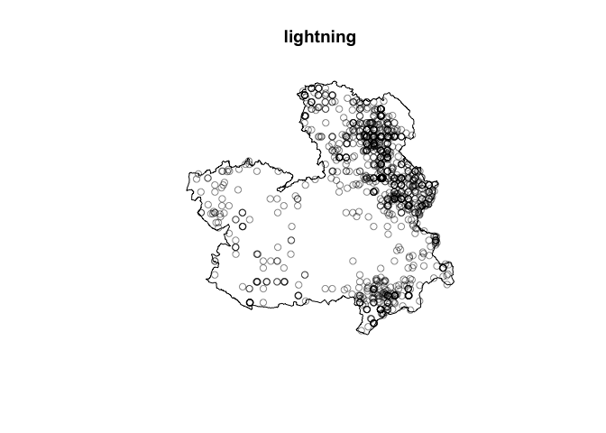
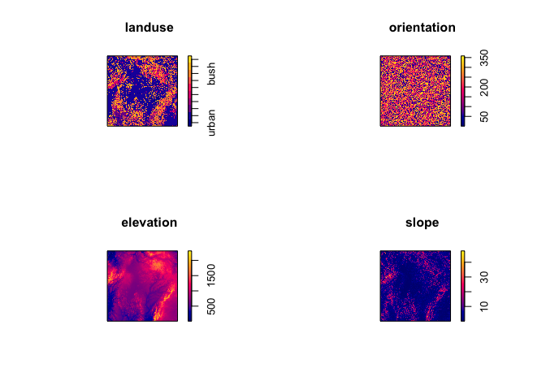

HW7
================

#### Matt Heaton Presentation

A recording of Matt Heaton’s presentation Spatial and Covariate-varying
Relationships Among Dominant Tree Species in Utah is available at
<https://montana.webex.com/montana/ldr.php?RCID=f56b4422a4b04a7da5f351c297ea8d9b>

##### 1\. (2 points)

What was Matt (and collaborator’s) research question?

##### 2\. (2 points)

How did Matt use spatial statistics to address the research question?

##### 3\. (2 points)

What did you learn from this presentation?

#### Point Process Modeling

Explore the Castilla-La Mancha forest fires dataset.

##### 4\. (2 points)

Determine whether the forest fires caused by lightning can be
represented as a homogoneous Poisson process

``` r
lightning <- unmark(split(clmfires)$lightning)
plot(lightning)
```

<!-- -->

##### 5\. (7 points)

Explore whether any of the covariate information is useful in explaining
the intensity of the point process. Summarize the model you fit and
include a plot of the estimated surface intensity.

``` r
landuse <- clmfires.extra$clmcov200$landuse
elevation <- clmfires.extra$clmcov200$elevation
orientation <- clmfires.extra$clmcov200$orientation
slope <- clmfires.extra$clmcov200$slope
par(mfcol = c(2,2))
plot(landuse)
plot(elevation)
plot(orientation)
plot(slope)
```

<!-- -->
